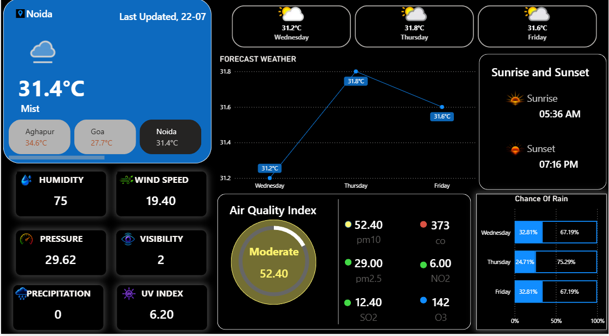

# 🌦 Live Weather Dashboard

<div align="center">


An interactive **Power BI Weather Dashboard** that displays live weather information, air quality metrics, and a 3-day forecast using data from **WeatherAPI**.

</div>

---

# 📸 Dashboard Preview

> Replace the image below with your dashboard screenshot.



---

# 📌 Features

✅ Live Current Weather

✅ 3-Day Weather Forecast

✅ Air Quality Index (AQI)

✅ UV Index

✅ Humidity

✅ Wind Speed

✅ Atmospheric Pressure

✅ Visibility

✅ Sunrise & Sunset

✅ Chance of Rain

✅ Interactive Dashboard

---

# 📊 Dashboard Includes

- Current Temperature
- Weather Condition
- Feels Like Temperature
- Wind Speed
- Humidity
- Pressure
- Visibility
- UV Index
- Air Quality (PM2.5, PM10, CO)
- Sunrise & Sunset
- 3-Day Forecast
- Rain Probability

---

# 🛠 Technologies Used

| Technology | Purpose |
|------------|----------|
| Power BI | Dashboard Development |
| Power Query | Data Cleaning & Transformation |
| DAX | Calculated Measures |
| WeatherAPI | Live Weather Data |
| REST API | Data Fetching |
| JSON | API Response Format |

---

# 📂 Project Structure

```
Live-Weather-Dashboard
│
├── Live_Weather_Dashboard.pbix
├── README.md
├── LICENSE
│
└── assets
    └── dashboard.png
```

---

# 🔄 Data Flow

WeatherAPI

⬇

REST API Request

⬇

Power Query

⬇

Data Transformation

⬇

Data Model

⬇

DAX Measures

⬇

Interactive Dashboard

---

# 🚀 How to Use

1. Download the `.pbix` file.
2. Open it in **Power BI Desktop**.
3. Replace the WeatherAPI key with your own (if required).
4. Refresh the dataset.
5. Explore the dashboard.

---

# 🎯 Skills Demonstrated

- Data Visualization
- Dashboard Design
- Power BI
- Power Query
- DAX
- REST API Integration
- JSON Parsing
- Data Cleaning
- Data Modeling

---

# 📈 Future Improvements

- 7-Day Forecast
- City Selection Slicer
- Mobile Responsive Layout
- Additional KPI Cards
- Historical Weather Trends
- Weather Alerts

---

# 👨‍💻 Author

**Saransh Mathur**

B.Tech (Artificial Intelligence & Machine Learning)

GitHub: https://github.com/YOUR_USERNAME

LinkedIn: https://linkedin.com/in/YOUR_PROFILE

---

# ⭐ If you like this project

Please consider giving it a ⭐ on GitHub.
